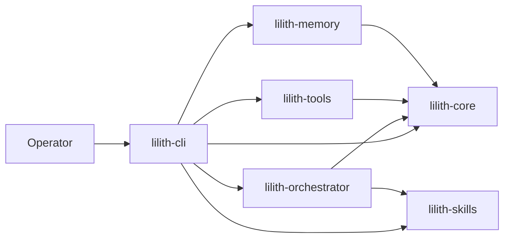

<p align="center">
  
</p>

# ᛚ Lilith CLI

<p>
  = 3.11">
  
  
  
</p>

**Norse-themed terminal IDE and AI agent interface.**

Lilith is a terminal-first coding environment: an interactive agent REPL, a full TUI IDE built on [Textual](https://textual.textualize.io/) with file tree, multi-tab editor, LSP, integrated terminal, Git operations and agent diff preview, plus orchestration commands for delegating bounded work.

> Born in the Yggdrasil ecosystem. This repository contains the complete open-source Lilith stack required by the CLI and terminal IDE.

## Architecture



## Packages

| Package | Description |
|---|---|
| [`lilith-cli`](lilith-cli/) | The `lilith` command: chat REPL, TUI IDE, delegation and ecosystem ops |
| [`lilith-core`](lilith-core/) | Base types, configuration, message bus, hooks, logging and LLM providers |
| [`lilith-skills`](lilith-skills/) | Skill management, agent cards and cross-agent context |
| [`lilith-orchestrator`](lilith-orchestrator/) | Agent routing, sub-agent presets, workflows and MCP integration |
| [`lilith-memory`](lilith-memory/) | Vector memory store: SQLite backend, semantic chunker, hashed-embedding RAG |
| [`lilith-tools`](lilith-tools/) | Coding, filesystem, MCP, search, delegation and operator tools used by the CLI |

## Security model

Lilith treats model output as untrusted input to a capability-scoped tool runtime. The public OSS surface is designed around explicit authority boundaries rather than implicit workstation trust.

- **Capability scopes:** tools declare whether they are read-only or mutating; review-only execution fails closed for tools without an explicit read-only capability.
- **Human approval boundaries:** external consequences, credentials and irreversible operations remain operator-gated.
- **Durable execution:** delegation intent and checkpoints are persisted before launch; unknown effects are never assumed safe to retry.
- **MCP and external-agent boundaries:** optional adapters are explicit, configuration-driven and fail closed when their wrapper or observation root is absent.
- **Secret handling:** credentials are referenced through environment variables and redacted from logs, fixtures and public configuration paths.
- **Private infrastructure separation:** workstation-specific privileged launchers, account routing and owner transports are intentionally outside the public core.

See [SECURITY.md](SECURITY.md) for vulnerability reporting and security scope.

## Installation

Requires Python ≥ 3.11 and [uv](https://docs.astral.sh/uv/).

```bash
git clone https://github.com/BrierAinz/lilith-cli.git
cd lilith-cli
uv sync
uv run lilith --help
```

Optional web console:

```bash
uv sync --package lilith-cli --extra web
uv run lilith web --help
```

## Quick start

### Agente conversacional de programación

En Windows, `lilith.ps1` sin argumentos abre la conversación de programación sobre
el directorio actual. También puedes fijar el proyecto de forma explícita:

```powershell
.\lilith.ps1 start --root D:\path\to\project --profile agent
```

Pídele el objetivo en lenguaje natural, por ejemplo: «reproduce este fallo, corrige
su causa y ejecuta las pruebas pertinentes». `/capabilities` muestra las herramientas
reales disponibles y `/kit` las guías incluidas. Consulta el
[roadmap del CLI de programación](CODING_CLI_ROADMAP.md).

### La Hoguera — personal workspace

Lilith's standalone entry point now connects setup, project sessions and recovery.
Its personal direction is Nordic / Souls / anime: obsidian, ice blue and aged gold,
with restrained runes and clear technical language.

```powershell
uv sync --locked --all-packages --extra dev
uv run --no-sync lilith setup
uv run --no-sync lilith persona --apply
uv run --no-sync lilith start --root D:\path\to\project
```

`setup` asks for a model ID and an OpenAI-compatible endpoint. For remote endpoints,
provide the **name** of an environment variable containing your credential, never
the credential as a CLI argument. Existing provider settings and raw secret
references are preserved in a backup. Existing custom personalities are preserved
unless you explicitly apply Lilith's personality.

```powershell
uv run --no-sync lilith setup --model YOUR_MODEL --base-url https://your-provider.example/v1 --key-env MY_LLM_KEY
uv run --no-sync lilith home --root D:\path\to\project
uv run --no-sync lilith start --root D:\path\to\project --resume SESSION_ID
```

The model server must already be running or reachable. Saving configuration does
not verify model availability or tool-calling support. `lilith doctor --help`
describes connection checks. The OpenAI-compatible path works without the optional
LiteLLM extra; that extra may require native build tools on Windows.

Inside chat, `/goal` tracks a saga and `/help` exposes the existing tools, memory
and skills commands. The Hoguera shows saved goals and sessions for the selected
project. History is saved atomically after each model turn and at exit; disabling
`history.save` disables those snapshots. Resume requires a matching recorded
project root and uses the **current** provider configuration. Older sessions without
a project root remain accessible through the existing `/resume` command.

On Windows, run `lilith.ps1` from this repository, or call its absolute path from
your project directory. It preserves the working directory and uses the installed
workspace environment. Running Lilith with no arguments opens the interactive
Hoguera: choose a project, search sessions and start or resume with Enter.
`lilith home --interactive --root PATH` opens it explicitly; `home` without
`--interactive` remains a printable report. Bifröst remains separate background infrastructure.

The Hoguera uses a short entrance fade, subtle ambient rune movement and a compact
layout below 90 terminal columns. `F6` toggles and saves reduced motion;
`Ctrl+F` focuses search, `Esc` clears it, `Ctrl+N` begins a saga, `F5` refreshes
sessions and `Ctrl+Q` exits. The project path is editable in the sidebar.

### Verified tasks, recovery and memory

The [robust agent kit](ROBUST_AGENT_KIT.md) packages eight skills and three execution
profiles. Select **Compacto**, **Estándar** or **Lector** in the Hoguera, or use
`task --profile compact --skill bug-fix`. `kit list`, `kit doctor` and `kit probe`
expose the installed workflows, local tools and a bounded provider format check.
The [calibration suite](CALIBRATION.md) compares models on fixed synthetic tasks;
`calibration apply` binds mutation eligibility to a matching, complete report.

The Hoguera now runs work directly: **Nueva saga** opens an objective form with
four templates, a file picker, an explicit verification command and an edit toggle.
Activity, reported tokens, elapsed time and observed file changes remain visible.
Pause waits for a safe checkpoint; cancellation preserves unknown effects for
review. Saved UI tasks reopen with their original scope and baseline.

The **Cambios** tab shows the selected files' before/after diff. **Aceptar** records
a local review tied to current file hashes; it never commits or publishes, and
refuses acceptance if a file changed after review. Edits have already been applied
in the project directory, as indicated by the edit toggle. **Pruebas** displays
the actual verification output. **Memoria** lets you add, correct or forget
preferences separately for yourself and for the selected project.

Each UI task runs in a separate process with a request file, private baseline and
result record under the local configuration directory's `task-runs/` folder.
Task arguments/content are not copied into its process command line. Cancellation
of an already-running verification command waits for that command's bounded timeout.

```powershell
uv run --no-sync lilith task "Implementa la corrección y sus pruebas" --root D:/ruta/proyecto --verify "node --test tests/fix.test.mjs"
uv run --no-sync lilith task "Continúa desde el checkpoint" --root D:/ruta/proyecto --resume SESSION_ID --verify "node --test tests/fix.test.mjs"
uv run --no-sync lilith remember set design_style "Nórdico, Souls y anime"
uv run --no-sync lilith remember set test_command "node --test" --project D:/ruta/proyecto
uv run --no-sync lilith remember list
uv run --no-sync lilith remember forget design_style
```

`task` checkpoints each tool's intent and result. `--pause-after-tools N` exits at
a safe checkpoint. Resume refuses unknown tool effects and reuses confirmed write
receipts only when the file hash still matches; changed files require inspection.
`--allow-tools file_read,file_write --allowed-files source.js,tests/fix.test.mjs`
restricts the task to specific tools and files. `--yes` enables direct edits in
default mode. Project directory alone is not a sandbox.

Activity goes to stderr; the final JSON stays on stdout. `--quiet` hides activity.
`--verify` runs an explicit local command without a shell, with a 120-second cap.
Exit zero with no output does not count as verification. Failed checks can trigger
one correction pass (`--repair-attempts 0..3`), bounded by the same tool/file scope.
`responded` means the model answered; `verified` means the supplied command passed.
It does not establish release approval or exhaustive correctness.

Explicit preferences use the existing PreferenceStore in a separate local database;
project preferences override personal ones only for that root. Disabling runtime
memory also disables their injection into the model context. Review what you store:
preferences become context for the configured provider, not credentials storage.

### Local versioned installation

```powershell
uv run --no-sync lilith installation update --source . --ref HEAD
uv run --no-sync lilith installation status
uv run --no-sync lilith installation rollback
```

Updates package an existing local Git commit into a separate release directory,
install its locked dependencies, and run a CLI smoke before switching the active
pointer. The launcher honors that pointer. No fetch, reset, merge or publication is
performed. Rollback validates the preceding release and switches back, retaining
both versions. User configuration and conversations stay outside release folders;
this mechanism does not roll back database migrations. `LILITH_RELEASES_DIR` can
isolate installation tests. Use the source checkout's `uv run --no-sync` command
for maintenance when an older activated version lacks these new commands.

### Existing commands (reference)

### Inspect a collaborator job without a model

To start Lilith as a focused coordinator while keeping your configured model:

```powershell
.\lilith.ps1 start --root D:\ruta\proyecto --profile coordinator
```

This opt-in profile exposes nine file/collaboration tools, serial tool execution,
strict arguments and bounded context/results. It does not enable shell tools,
change the selected model or override calibration/agent-mode/operation authority.
Compact, standard and reader retain their existing file-task roles. The coordinator
can use existing Vor/Huginn delegates; direct Muninn/Gemini delegation is not yet
integrated into this profile.
La Hoguera also offers **Coordinar / F8** for this entry point using the selected
project. **Colaboradores / F7** remains read-only inspection, not a launch action.
Saved conversations retain the execution profile. `start --resume ID` restores it;
an explicit `--profile` takes precedence. Slash `/resume` within an already running
session retains that session's current profile instead of widening its tools.

Use the ID returned by a delegation, not the newest file in a shared job folder:

```powershell
.\lilith.ps1 jobs inspect Vor 20260912-000001-1234
.\lilith.ps1 jobs inspect Huginn 20260912-000001-1234 --json
.\lilith.ps1 jobs recent
```

The IDs above are examples. This command reads the named completion marker and,
for Vor, its optional bounded cleanup receipt without exposing its lease token;
it does not launch, retry, cancel, read transcripts or invoke a provider. Exit 0
means a marker was observed, **not** that the delegated task succeeded: check
`observation.status` and `job_returncode`. Exit 2 means invalid input or a read
failure; exit 3 means unknown (missing marker, not proof of a running process).
Reported success still needs review of the actual work.

New delegations save a local reference before launching. `jobs recent` lists the
last 20 references across sessions without contacting a worker. The separate
`cli_jobs.sqlite3` journal lives beside the orchestration state and stores only
metadata and a task hash, not prompts or responses. Failure to save intent blocks
launch; failure to save the observation preserves the original reference and does
not retry. An empty observation means unknown, not running or completed. This is
not automatically idempotent: without `request_id`, invoking delegation again
creates a new attempt. The `vor_delegate` and `huginn_delegate` tools accept an
optional 32-lowercase-hex `request_id`. Reusing it with identical task, agent,
timeout, launcher arguments and caller working directory returns the existing
reference without dispatch; changed intent is rejected. Retain the same key when
recovering. A new key is a new attempt, not recovery. This does not guarantee the
worker completed, nor protect across deletion/replacement of the journal.
The primary AgentSession assigns missing keys from a saved conversation namespace
and exact tool arguments/caller directory. Repeating identical arguments with a
new model tool-call ID therefore reuses the attempt. Explicit new keys still mean
new attempts; legacy sessions without the namespace cannot promise this retrospectively.
Use `lilith.ps1 jobs inspect-reference REFERENCE` with a reference from `jobs recent`
to query its saved worker ID after reopening Lilith. Missing references or attempts
without a captured worker ID return exit 3 without querying or launching a worker.
Invalid/corrupt references return exit 2. The original observation is not overwritten.
In La Hoguera, **Colaboradores / F7** opens saved references. Enter queries the
selected marker; F5 refreshes and Esc returns. The list is global, not filtered
by project, and has no launch/retry/cancel controls.

### Optional collaborator adapters

The public repository does not ship privileged launchers or assume a workstation layout.
External Vor/Huginn/Muninn-compatible wrappers are opt-in and are configured explicitly:

```text
LILITH_VOR_WRAPPER
LILITH_VOR_HOME2
LILITH_HUGINN_WRAPPER
LILITH_MUNINN_WRAPPER
LILITH_VOR_JOB_ROOT
LILITH_HUGINN_JOB_ROOT
```

Without these variables, delegation fails closed as `not_configured`. Lilith does not
create saved credentials, elevate the operating-system identity, or infer private job
directories. The wrapper contract is an integration point, not part of the base install.

### Other commands

```bash
lilith chat                  # interactive agent REPL
lilith ide                   # launch the TUI IDE
lilith prompt "hello"        # one-shot prompt
lilith status                # ecosystem status
```

Full IDE documentation — layout, keyboard shortcuts, chat commands, LSP and session persistence — lives in [`lilith-cli/README.md`](lilith-cli/README.md).

## Design boundary

Lilith CLI is the public terminal workspace and interface layer. It is intentionally separated from private orchestration and infrastructure repositories so the open-source surface can remain understandable and usable on its own.

## Contributing and security

- [Contributing guide](CONTRIBUTING.md)
- [Security policy](SECURITY.md)
- [Changelog](CHANGELOG.md)
- [Code of conduct](CODE_OF_CONDUCT.md)

Bug reports and feature proposals use the structured templates under `.github/ISSUE_TEMPLATE/`.

## Repository artwork

The version-controlled social artwork is available at [`assets/social-preview.svg`](assets/social-preview.svg). Repository settings may use a rasterized export of this source when configuring GitHub's social preview.

## License

[MIT](LICENSE) © 2026 BrierAinz / BrierStudios
