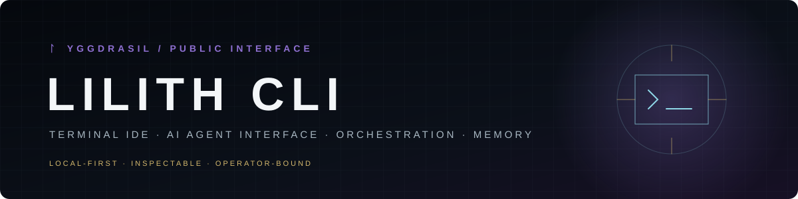
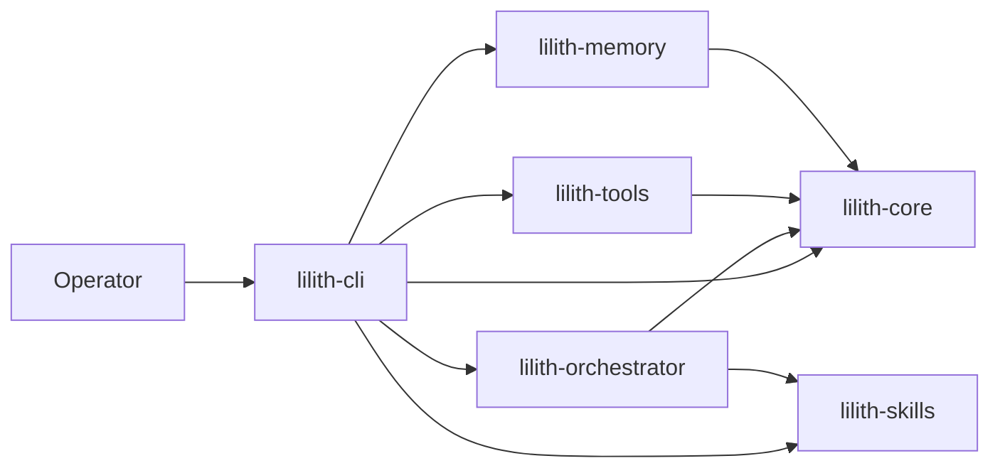

<p align="center">
  
</p>

# ᛚ Lilith CLI

<p>
  = 3.11">
  
  
  
</p>

**Norse-themed terminal IDE and AI agent interface.**

Lilith is a terminal-first coding environment: an interactive agent REPL, a full TUI IDE built on [Textual](https://textual.textualize.io/) with file tree, multi-tab editor, LSP, integrated terminal, Git operations and agent diff preview, plus orchestration commands for delegating bounded work.

> Born in the Yggdrasil ecosystem. This repository contains the complete open-source Lilith stack required by the CLI and terminal IDE.

## Architecture



## Packages

| Package | Description |
|---|---|
| [`lilith-cli`](lilith-cli/) | The `lilith` command: chat REPL, TUI IDE, delegation and ecosystem ops |
| [`lilith-core`](lilith-core/) | Base types, configuration, message bus, hooks, logging and LLM providers |
| [`lilith-skills`](lilith-skills/) | Skill management, agent cards and cross-agent context |
| [`lilith-orchestrator`](lilith-orchestrator/) | Agent routing, sub-agent presets, workflows and MCP integration |
| [`lilith-memory`](lilith-memory/) | Vector memory store: SQLite backend, semantic chunker, hashed-embedding RAG |
| [`lilith-tools`](lilith-tools/) | Coding, filesystem, MCP, search, delegation and operator tools used by the CLI |

## Installation

Requires Python ≥ 3.11 and [uv](https://docs.astral.sh/uv/).

```bash
git clone https://github.com/BrierAinz/lilith-cli.git
cd lilith-cli
uv sync
uv run lilith --help
```

## Quick start

```bash
lilith chat                  # interactive agent REPL
lilith ide                   # launch the TUI IDE
lilith prompt "hello"        # one-shot prompt
lilith status                # ecosystem status
```

Full IDE documentation — layout, keyboard shortcuts, chat commands, LSP and session persistence — lives in [`lilith-cli/README.md`](lilith-cli/README.md).

## Design boundary

Lilith CLI is the public terminal workspace and interface layer. It is intentionally separated from private orchestration and infrastructure repositories so the open-source surface can remain understandable and usable on its own.

## Contributing and security

- [Contributing guide](CONTRIBUTING.md)
- [Security policy](SECURITY.md)
- [Code of conduct](CODE_OF_CONDUCT.md)

Bug reports and feature proposals use the structured templates under `.github/ISSUE_TEMPLATE/`.

## Repository artwork

The version-controlled social artwork is available at [`assets/social-preview.svg`](assets/social-preview.svg). Repository settings may use a rasterized export of this source when configuring GitHub's social preview.

## License

[MIT](LICENSE) © 2026 BrierAinz / BrierStudios
