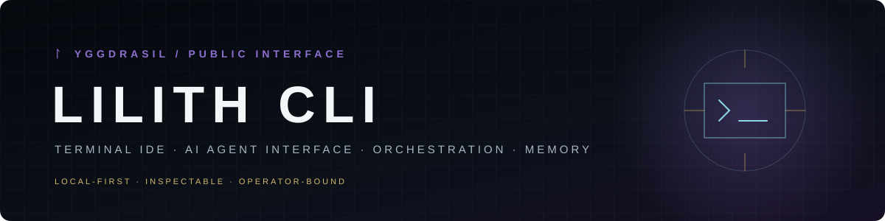
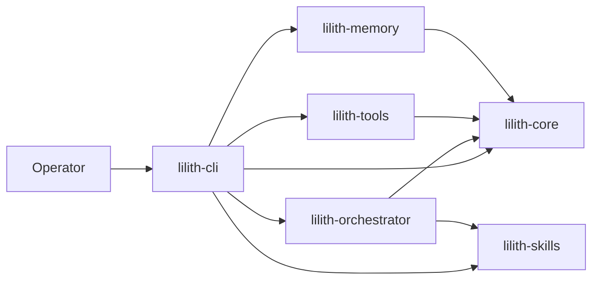

<p align="center">
  
</p>

# ᛚ Lilith CLI

<p>
  = 3.11">
  
  
  
</p>

**Norse-themed terminal IDE and AI agent interface.**

Lilith is a terminal-first coding environment: an interactive agent REPL, a full TUI IDE built on [Textual](https://textual.textualize.io/) with file tree, multi-tab editor, LSP, integrated terminal, Git operations and agent diff preview, plus orchestration commands for delegating bounded work.

> Born in the Yggdrasil ecosystem. This repository contains the complete open-source Lilith stack required by the CLI and terminal IDE.

## Project status

Lilith CLI is an active public workspace for terminal-first agent development.
The current open-source surface focuses on the CLI, Textual IDE, capability-scoped
tools, local memory, durable task execution and explicit recovery boundaries.

| Area | Status |
|---|---|
| Primary platform | Windows-native development, with Python 3.11+ workspace support |
| Interface | Chat REPL, Textual TUI IDE, Hoguera workspace and task runner |
| Safety model | Capability-scoped tools, persisted intent, bounded verification and operator review |
| Private boundary | Privileged launchers, account routing and workstation-specific orchestration are intentionally out of scope |

## Quick start

Requires Python 3.11+ and [uv](https://docs.astral.sh/uv/). Lilith talks to a
local model or any OpenAI-compatible endpoint that is already running.

```bash
git clone https://github.com/BrierAinz/lilith-cli.git
cd lilith-cli
uv sync
uv run lilith setup        # model ID + endpoint; API keys are read from an env var you name
uv run lilith start --root /path/to/project
```

On Windows, `.\lilith.ps1` runs the same CLI from any directory (with no
arguments it opens the conversation for the current directory). Inside the
conversation, describe the goal in plain language ("reproduce this failure,
fix the cause and run the relevant tests"); `/help` lists the commands,
`/capabilities` the tools and `/kit` the bundled guides.

`lilith setup --model YOUR_MODEL --base-url https://provider.example/v1 --key-env MY_LLM_KEY`
does the same without prompts. Saving the configuration does not check that
the model is reachable; `lilith doctor` does.

## What you get

| Command | What it does |
|---|---|
| `lilith start` / `lilith chat` | Agent conversation bound to a project, with checkpoints and resume |
| `lilith home` | La Hoguera: projects, saved sessions and recovery in a Textual UI |
| `lilith task "goal" --verify "cmd"` | A checkpointed task that only counts as verified when your command passes |
| `lilith ide` | Textual IDE: file tree, tabs, LSP, terminal, Git and agent diff preview |
| `lilith web` | Local browser console: read-only files plus the agent chat ([guide](docs/web-console.md)) |
| `lilith remember` | Personal and per-project preferences the agent receives as context |
| `lilith installation` | Versioned local installs with update and rollback |

The [operator guide](docs/operator-guide.md) covers La Hoguera, verified tasks,
recovery, preferences, versioned installations and the optional collaborator
adapters. The IDE's layout, shortcuts and chat commands are in
[`lilith-cli/README.md`](lilith-cli/README.md).

## Architecture


```mermaid
flowchart LR
    U[Operator] --> C[lilith-cli]
    C --> CORE[lilith-core]
    C --> ORCH[lilith-orchestrator]
    C --> MEM[lilith-memory]
    C --> SK[lilith-skills]
    C --> TOOLS[lilith-tools]
    ORCH --> CORE
    ORCH --> SK
    TOOLS --> CORE
    MEM --> CORE
```

## Packages

| Package | Description |
|---|---|
| [`lilith-cli`](lilith-cli/) | The `lilith` command: chat REPL, TUI IDE, web console, tasks and delegation |
| [`lilith-core`](lilith-core/) | Base types, configuration, message bus, hooks, policies, sandbox and LLM providers |
| [`lilith-skills`](lilith-skills/) | Skill management, agent cards and cross-agent context |
| [`lilith-orchestrator`](lilith-orchestrator/) | Agent routing, sub-agent presets, workflows and MCP integration |
| [`lilith-memory`](lilith-memory/) | Local memory: SQLite store, semantic chunker, hashed-embedding recall, ontology graph |
| [`lilith-tools`](lilith-tools/) | Agent tools: files, coding (test/lint/format), Git, search, MCP, delegation and recall |

## Security model

Lilith treats model output as untrusted input to a capability-scoped tool runtime. The public OSS surface is designed around explicit authority boundaries rather than implicit workstation trust.

- **Capability scopes:** tools declare whether they are read-only or mutating; review-only execution fails closed for tools without an explicit read-only capability.
- **Human approval boundaries:** external consequences, credentials and irreversible operations remain operator-gated.
- **Durable execution:** delegation intent and checkpoints are persisted before launch; unknown effects are never assumed safe to retry.
- **MCP and external-agent boundaries:** optional adapters are explicit, configuration-driven and fail closed when their wrapper or observation root is absent.
- **Secret handling:** credentials are referenced through environment variables and redacted from logs, fixtures and public configuration paths.
- **Private infrastructure separation:** workstation-specific privileged launchers, account routing and owner transports are intentionally outside the public core.
- **Project code is not trusted by default:** IDE plugins shipped in a repository run only after `/plugins trust`, and the web console only answers local `Host`/`Origin` requests when no token is set.

See [SECURITY.md](SECURITY.md) for vulnerability reporting and security scope.

## Development

```bash
uv sync --locked --all-packages --extra dev --extra web
uv run pytest lilith-cli/tests     # or any package's tests/
uv run ruff check .
uv run mypy                        # library packages
```

CI runs the tests on Linux and Windows with Python 3.11–3.13, plus ruff, mypy,
coverage and a build of the web frontend. See [CONTRIBUTING.md](CONTRIBUTING.md).
Command and IDE extensions are described in [docs/plugins.md](docs/plugins.md).

## Documentation

- [Operator guide](docs/operator-guide.md) — La Hoguera, tasks, recovery, installations, collaborators
- [Robust agent kit](docs/robust-agent-kit.md) and [calibration](docs/calibration.md)
- [Web console](docs/web-console.md) and [plugins](docs/plugins.md)
- [Coding CLI roadmap](docs/coding-cli-roadmap.md)
- Design notes: [Hearth workspace v2](docs/hearth-workspace-v2.md), [personal workspace](docs/personal-workspace.md), [acceptance 2026-09-07](docs/acceptance-2026-09-07.md)

## Design boundary

Lilith CLI is the public terminal workspace and interface layer. It is intentionally separated from private orchestration and infrastructure repositories so the open-source surface can remain understandable and usable on its own.

## Contributing and security

- [Contributing guide](CONTRIBUTING.md)
- [Security policy](SECURITY.md)
- [Changelog](CHANGELOG.md)
- [Code of conduct](CODE_OF_CONDUCT.md)

Bug reports and feature proposals use the structured templates under `.github/ISSUE_TEMPLATE/`.

## Repository artwork

The version-controlled social artwork is available at [`assets/social-preview.svg`](assets/social-preview.svg). Repository settings may use a rasterized export of this source when configuring GitHub's social preview.

## License

[MIT](LICENSE) © 2026 BrierAinz / BrierStudios
